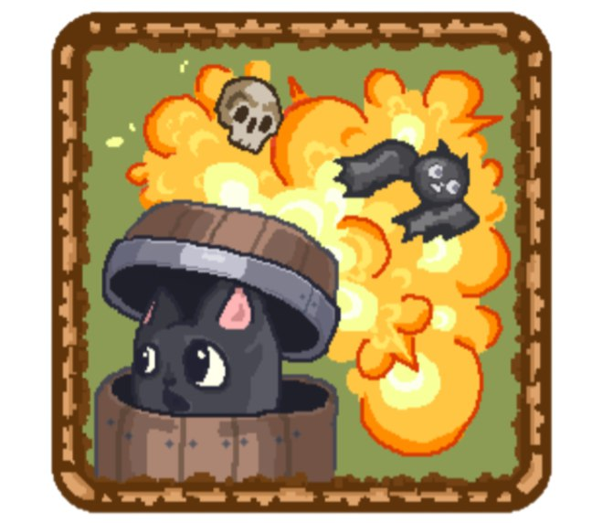

# Креативный Кот

## Общая информация

- **Название игры:** Креативный Кот
- **Жанр:** [Roguelike](https://ru.wikipedia.org/wiki/Roguelike)
- **Платформа:** Android
- **Целевая аудитория:** E (7+)

## Краткое описание

**Креативный Кот** — это увлекательная [roguelike](https://ru.wikipedia.org/wiki/Roguelike) игра, в которой игрок управляет котом, который упал в пещеру. Найдя волшебную [бочку](doc/gameplay/player/Barrel.md), кот начинает катиться внутри нее и бросать [бомбы](doc/gameplay/player/projectiles/Bomb.md), чтобы преодолевать препятствия и сражаться с врагами. Игроки должны использовать свои навыки и стратегию, чтобы продвигаться по уровням.

## Сюжет

В начале игры игрок знакомится с котом по имени [Диоген](doc/Diogenes.md), который случайно попадает в таинственную пещеру, полную опасностей и загадок. В пещере [Диоген](doc/Diogenes.md) находит волшебную бочку, которая становится его средством передвижения. Он сталкивается с различными врагами и ловушками, которые требуют стратегического мышления и ловкости. В конце, преодолев все испытания и победив финального босса, [Диоген](doc/Diogenes.md) находит выход из пещеры и возвращается домой, обретя новые силы и опыт.

## Подробнее

- [Геймплей](doc/gameplay/Description.md)

  - [Механики](doc/gameplay/Mechanics.md)
  - [Игрок](doc/gameplay/player/player.md)
  - [Предметы](doc/gameplay/Items.md)
  - [Противники](doc/gameplay/enemies/enemies.md)
  - [Ловушки](doc/gameplay/Traps.md)

- [Главный герой](doc/Diogenes.md)
- [Локации](doc/Locations.md)
- [Дорожная карта](doc/Roadmap.md)

## Лицензия

Для большей информации посмотрите [LICENSE](LICENSE) файл.

- MIT
